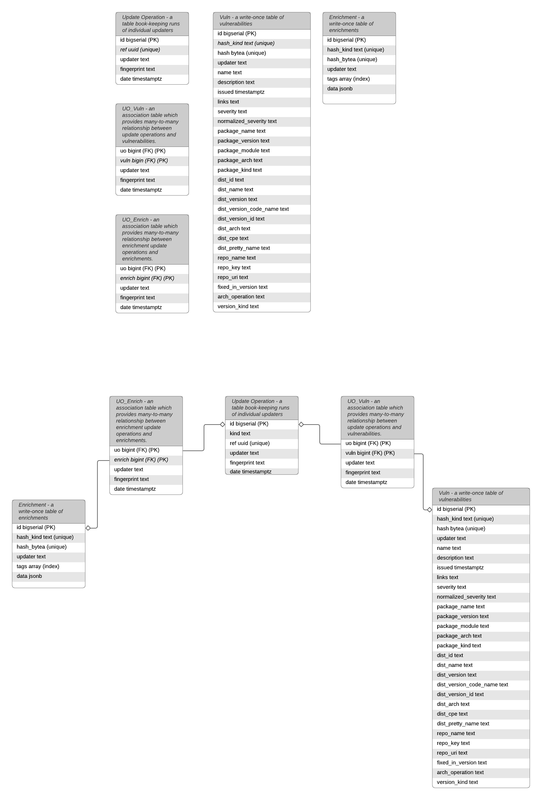

# Clair Enrichment Implementation Plan (ClairCore)

This document will cover the implementation details necessary
to support the Clair Enrichment Specification.

This document specifies a header per-task.
Each header can be viewed as an individual ticket to accomplish
the implementation of the Clair Enrichment Specification.

## Libvuln Driver Package Additions

The EnrichmentRecord struct and EnrichmentUpdater interface **must** be added
to libvuln's driver package.

```golang
/libvuln/driver/enrichment.go

// EnrichmentRecord is a simple container for JSON Enrichment data
// and the tags it will be queried by.
type EnrichmentRecord struct {
      Tags []string
      Enrichment json.RawMessage
}

// EnrichmentUpdater fetches an Enrichment data source, parses its contents,
// and returns individual EnrichmentRecords.
type EnrichmentUpdater interface {
      // A unique name for this updater.
      // The name preferable indicates the vendor who implemented
      // it and the enrichment data source its fetching and downloading.
      Name() string
      // When called the updater must return an io.ReadCloser to the enrichment data source.
      // and a Fingerprint of this data source.
      FetchEnrichment (context.Context, Fingerprint) (io.ReadCloser, Fingerprint, error)
      // When called the updater must read from the provided io.ReadCloser, parse its contents
      // and return a set of EnrichmentRecord(s)
      ParseEnrichment (context.Context, io.ReadCloser) ([]EnrichmentRecord, error)
}
```

Additionally a NoopUpdater type **must** be defined which EnrichmentUpdaters will
embed if they do not implement the Updater interface as well.

This allows an EnrichmentUpdater to fit into the normal Updater machinery
with minimal changes to business logic.

```golang
/libvuln/driver/updater.go

// NopUpdater is designed to be embedded into other
// Updater types so they can be used in the original
// updater machinery.
//
// This may go away if the Updater interface becomes Vulnerability agnostic
// in the future.
type NopUpdater struct{}

func (u NopUpdater) Name() string {
	return "NopUpdater"
}

func (u NopUpdater) Fetch(_ context.Context, _ Fingerprint) (io.ReadCloser, Fingerprint, error) {
	return io.NopCloser(bytes.NewReader(nil)), "", nil
}

func (u NopUpdater) Parse(_ context.Context, contents io.ReadCloser) ([]*claircore.Vulnerability, error) {
	return []*claircore.Vulnerability{}, nil
}
```

Additionally, the EnrichmentGetter interface **must** be defined.
This interface provides a handle to allow an Enricher to retrieve
Enrichments from the Vulnstore without allowing it full access to
all EnrichmentRecord(s).

```golang
// EnrichmentGetter is a handle to obtain Enrichment(s) given a tag.
//
// This interface must be scoped down to only retrieve EnrichmentRecord(s)
// associated with a single MIME type.
type EnrichmentGetter interface {
  GetEnrichment(tags []string) ([]EnrichmentRecord, error)
}
```

Take notice, the  `GetEnrichment` method only takes tags and returns EnrichmentRecord(s).
This will be expanded on momentarily.

Finally the Enricher interface **must** be added to this package.

```golang
type Enricher interface {
    // A unique name for this updater.
    // The name preferable indicates the vendor who implemented
    // it and matches the cooresponding EnrichmentUpdater.
    Name() string
    // Enrich extracts a set of tags from the provided VulnerabilityReport and utilizes 
    // the provided EnrichmentGetter to retrieve any Enrichments associated with the query tags.
    //
    // The implemented Enricher returns raw JSON blogs of the retrieved Enrichment data and a key
    // explaining to the client how to interpret the data.
    Enrich(ctx context.Context, e EnrichmentGetter, v *claircore.VulnerabilityReport) (key mime, []json.RawMessage, error)
}
```

## Libvuln Data Model Changes

The vulnstore data model must be updated to support Enrichment data and update
operations.

A new "kind" key will be added to the update_operation table allowing the necessary
vulnstore methods to differentiate between vulnerability database update operations
and enrichment database update operations.



The valid type values will be "vulnerability" and "enrichment".

A migration **must** be created which both adds the "kind" column to the update_operation
table and populates all existing update_operation records with the "vulnerability"
type.

## Vulnstore Updater Interface Changes

As mentioned above, interfaces in the vulnstore package must be updated to
differentiate between the new update operation types.

The following methods on the Updater interface must be modified:

TODO(add string consts for uo types)
```golang
/internal/vulnstore/updater.go

// GetUpdateOperations returns a list of UpdateOperations in date descending
// order for the given updaters.
//
// The returned map is keyed by Updater implementation's unique names.
//
// If a type key is provided only Updaters of the given type will be returned.
//
// If no updaters specified, all UpdateOperations are returned, but still filtered
// by the type.
//
// Providing an empty string for type will avoid any filtering in all cases.
GetUpdateOperations(ctx context.Context, type string, updaters ...string) (map[string][]driver.UpdateOperation, error)
// GetLatestUpdateRefs reports the latest update reference for every known
// updater.
//
// Providing a type string will filter the results to only the specified type.
GetLatestUpdateRefs(context.Context, type string) (map[string][]driver.UpdateOperation, error)
// GetLatestUpdateRef reports the latest update reference of any known
// updater.
//
// Providing a type string will filter the results to only the specified type.
GetLatestUpdateRef(context.Context, type string) (uuid.UUID, error)
```

The postgres implementation **must** then be updated to support the functionality
commented above.

A bit more subtly, the `GetUpdateDiff` method on this interface **must** be updated
to only consider "vulnerability" update operations, as this method
returns a data structure explicit to vulnerabilities.

Additionally, the `UpdateVulnerabilities` method **must** be updated to create
Update Operation rows with `kind = 'vulnerability'` moving
forward.

## Vulnstore EnrichementUpdater Interface Addition

A new interface **must** be created to support persisting EnrichmentRecord(s)
in the vulnstore.

```golang

/internal/vulnstore/updater.go

// Enricher is an interface exporting the necessary methods
// for storing and querying Enrichments.
type EnrichmentUpdater interface {
	// UpdateEnrichments creates a new EnrichmentUpdateOperation, inserts the provided
	// EnrichmentRecord(s), and ensures enrichments from previous updates are not
	// queries by clients.
	UpdateEnrichments(ctx context.Context, mime string, fingerprint driver.Fingerprint, enrichments []driver.EnrichmentRecord)
}
```
The postgres implementation **must** then be updated to support the functionality
commented above.

This interface **must** be embedded into the existing `Updater` interface within
the vulnstore package.

This embedding signifies that the existing UpdateOperation methods are useful for
both Enrichment update operations and Vulnerability update operations.

If the desire to "diff" Enrichment update operations evolves, a new method **should**
be added to this interface and a new data structure for expressing
added and removed EnrichmentRecord(s) must be created.

## Update Manager Changes

The update manager, responsible for running updaters, must be refactored to 
also run EnrichmentUpdaters.

This is made possible with the NopUpdater structure outlined in the very
first section.

All EnrichmentUpdaters will also implement the Updater interface, even
if those interface methods perform no actions.

After the update manager runs an updater's default set of methods (Fetch, Parse)
it will perform a type assertion to determine if the updater is
also an EnrichmentUpdater.

If it is, it will run it's EnrichmentUpdater methods (FetchEnrichment, ParseEnrichment)
and store the EnrichmentRecord(s) into the vulnstore.

These changes **should** occur in the following method:
<https://github.com//ldelossa/claircore/blob/master/libvuln/updates/manager.go>

## Libvuln Enricher Construction

A set of default Enrichers **must** become available
in a fasion similar to Matchers.

Each Enricher must be constructable during Scan time.

A registry **may** be created for this purpose.

Alternatively a global slice variable maybe
used akin to:
<https://github.com/ldelossa/claircore/blob/release-0.1/libvuln/opts.go#L100>

Each Enricher will need to implement their Enricher method as a pure function
if a static list of constructed Enricher(s) is used.

TODO(add a way to inject configuration into Enricher construction)

## Libvuln Scan Additions

A new phase in libvun's scan process will be added.

Currently the scan process instantiates all available
Matchers and streams IndexRecord(s) to each one.

Each updater creates a Vulnerability Report and
Clair merges them together.

A new step will be added to after the merging of the Vulnerability
Report.

In this new phase all registered Enrichers will be created in parallel
and their Enrich method will be called.

The results of these method calls will be added to the new Enrichments
field on the Vulnerability Report.

TODO(update libvuln scan diagram)
